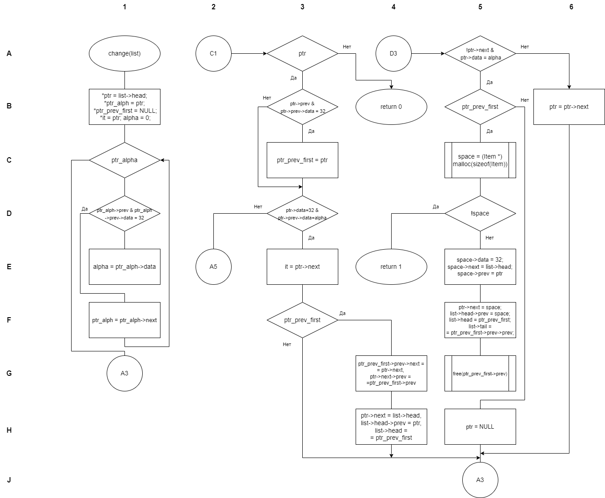

# Лабораторная работа №6  
_Работа со структурами данных на основе списков_

---

## Постановка задачи  
**Вариант №36**

Переместить в начало строки все слова, оканчивающиеся символом, с которого начинается последнее слово в строке.

---

## Описание решения  
### Используемые типы данных  
- `List` - структура для представления двусвязного списка:
  ```c
  typedef struct List {
      Item *head;
      Item *tail;
  } List;
  ```
- `Item` - элемент списка:
  ```c
  typedef struct Item {
      int data;        // Символ (ASCII-код)
      struct Item *prev;
      struct Item *next;
  } Item;
  ```
- `int` - для работы с целыми числами и кодами ошибок

### Блок-схемы алгоритмов
<table>
  <tr>
    <td>
      <figure>
        
        <figcaption>Функция main()</figcaption>
      </figure>
    </td>
    <td>
      <figure>
        
        <figcaption>Функция input()</figcaption>
      </figure>
    </td>
  </tr>
  <tr>
    <td colspan="2">
      <figure>
        
        <figcaption>Функция change()</figcaption>
      </figure>
    </td>
  </tr>
</table>

---

## Описание функций

### Файл list.h
- `listNew() -> List*`
    > Создание нового списка
    >
    > _ВОЗВРАЩАЕТ:_  
    >    * Указатель на созданный список

- `listDelete(List *list) -> void`
    > Удаление списка и освобождение памяти

- `listPrint(const List *list) -> void`
    > Вывод списка в виде строки

- `listInsert(List *list, int data) -> int`
    > Вставка элемента в список
    >
    > _ВОЗВРАЩАЕТ:_  
    >    * 0 при успехе, 1 при ошибке

### Файл change.h
- `input(List *list) -> int`
    > Ввод строки и преобразование в список
    >
    > _ВОЗВРАЩАЕТ:_  
    >    * 0 при успехе, 1 при ошибке или EOF

- `change(List *list) -> int`
    > Перемещение слов по заданному условию
    >
    > _ВОЗВРАЩАЕТ:_  
    >    * 0 при успехе, 1 при ошибке

---

## Тестирование

### Тестовые примеры

<table>
  <tr>
    <th>Входная строка</th>
    <th>Результат</th>
  </tr>
  <tr>
    <td>"betta y gamma delta alpha"</td>
    <td>"alpha delta gamma betta y"</td>
  </tr>
  <tr>
    <td>""</td>
    <td>""</td>
  </tr>
  <tr>
    <td>"abd dfgc uyew jhg uwu cat"</td>
    <td>"dfgc abd uyew jhg uwu ca"</td>
  </tr>
</table>

